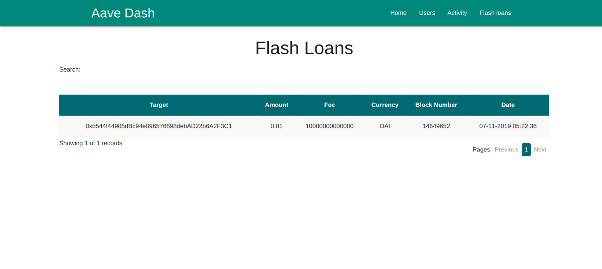

# Watchbird
This project requires Python, InfluxDB, Redis and static site server

## Install dependencies
```
cd aave-server
pip install requirements.txt
```

Init DB and Redis
```
docker run -p 127.0.0.1:8086:8086 -p 127.0.0.1:8083:8083  -e INFLUXDB_ADMIN_ENABLED=true           -v $PWD:/var/lib/influxdb -d --name influx           influxdb
docker run -p 127.0.0.1:6379:6379 --name redis redis
```

Create the DB and seed the DB
```
export NETWORK_URL=https://kovan.infura.io/v3/f.....b6759
invoke db.create
invoke db.seed
```

## Run the server
Start Celery to run periodic task to update based on new events
```
celery -A common.tasks worker -B  -l info 
```

And now run the server
```
python3 main.py 
```

## View the data with de client
```
python -m http.server 80
```
### Home

### Events

### Users

### User

### Flash


## License
See [LICENSE](LICENSE)
